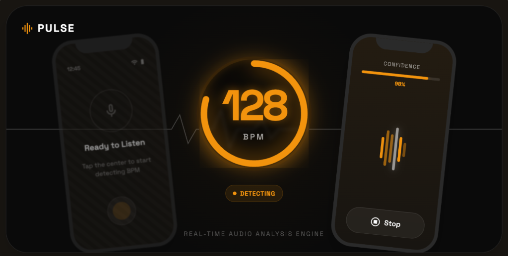

# Pulse 🎶

**Real-time Ambient Rhythm, Tracked.**

Tiny web app that keeps your ambient BPM detection visible. One-button flow, dynamic digital display, hardware-style locks. Point your phone at a speaker, press LISTEN, get BPM quickly. 



## Install

### Requirements
- Modern browser with AudioContext support

### Local Development
```bash
git clone https://github.com/everfacture/pulse-bpm-app.git
cd pulse-bpm-app
npm ci
npm run dev
```

## Features
- Hardware CDJ-style BPM Engine: Strict tempo locking for techno/house DJ sets.
- One-touch capture: Tap LISTEN to instantly hook into the microphone.
- Persistent Rhythm History: Session usage tracking of tempos across genres via IndexedDB.
- Trend Sparkline: Visual history of the last 50 stable readings.
- Harmonic Rejection: Intelligent tempo math prevents rapid double/half-time flickering.
- Privacy-first: On-device audio processing; nothing ever leaves your browser.
- PWA-ready deployment.

## What's Next
Built to ship fast. We work on this from time to time to mess with browser audio APIs. No hard promises or fixed release timelines.
- Better stability in highly ambient environments.
- History export flows.

## License
MIT.
