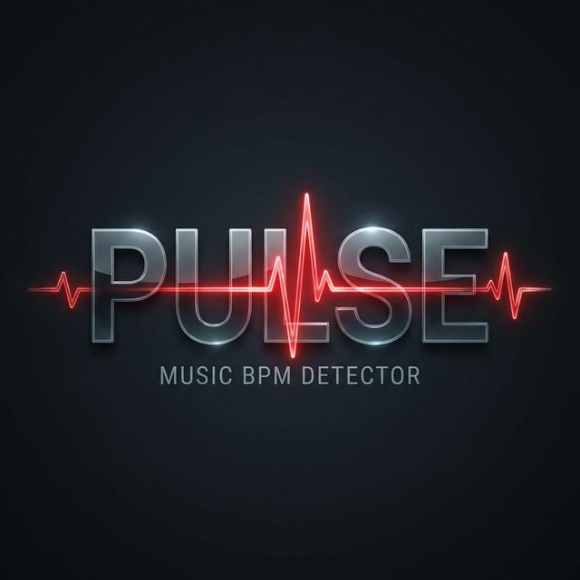

# PULSE — Ambient BPM Detector



[](https://github.com/everfacture/pulse-bpm-app/actions)
[](https://opensource.org/licenses/MIT)
[](http://makeapullrequest.com)

**PULSE** is a high-performance Progressive Web App (PWA) designed for real-time, ambient BPM detection. No tapping, no file imports—just point your microphone at the source and get an accurate beat-per-minute reading instantly.

[**Get Started**](#getting-started) | [**Architecture**](#architecture) | [**Contributing**](#contributing) | [**Changelog**](./CHANGELOG.md)

---

## 🚀 Getting Started

### Quick Install

```bash
# Clone the repository
git clone https://github.com/everfacture/pulse-bpm-app.git

# Enter the project directory
cd pulse-bpm-app

# Install dependencies
npm install

# Start development server
npm run dev
```

### Usage
1. Open the app in a modern browser (Chrome/Safari recommended).
2. Grant microphone permissions.
3. Click the **LISTEN** button while music is playing.
4. Watch the real-time BPM and confidence levels populate.

---

## 🏗 Architecture

Pulse follows a modular Web Audio API pipeline for efficient signal processing.

```text
[ Microphone ]  -->  [ AudioContext ]  -->  [ RealTimeBpmAnalyzer ]
                                                      |
                                                      v
[ Export (.csv) ] <--- [ LocalStorage ] <--- [ UI State Manager ]
```

### Key Subsystems
- **[Audio Engine](./src/main.js)**: Orchestrates the Web Audio pipeline and analyzer lifecycle.
- **[UI Core](./src/style.css)**: Premium dark-mode interface with glassmorphism and reactive animations.
- **[PWA Layer](./vite.config.js)**: Service worker registration and offline manifests via `vite-plugin-pwa`.

---

## ⚙️ Configuration

Pulse is configured out of the box for optimal ambient detection. To tune the sensitivity, modify the constructor in `src/main.js`:

```javascript
new RealTimeBpmAnalyzer({
    continuousAnalysis: true,
    stabilizationTime: 3000, // ms to wait for stable reading
    onBpmEvent: (data) => { ... }
});
```

---

## 🔐 Security & Permissions

Pulse is built with privacy in mind:
- **Zero Cloud Processing**: All audio analysis is performed locally in the browser sandbox.
- **Permission Boundary**: Microphone access is only requested when strictly necessary (upon clicking Listen).

---

## 🤝 Contributing

We welcome contributions! Please see our [Contributing Guide](./CONTRIBUTING.md) for details on our code of conduct and the process for submitting pull requests.

---

## 📄 License

This project is licensed under the MIT License - see the [LICENSE](./LICENSE) file for details.

---

*Designed and Built by everfacture — 2026*
